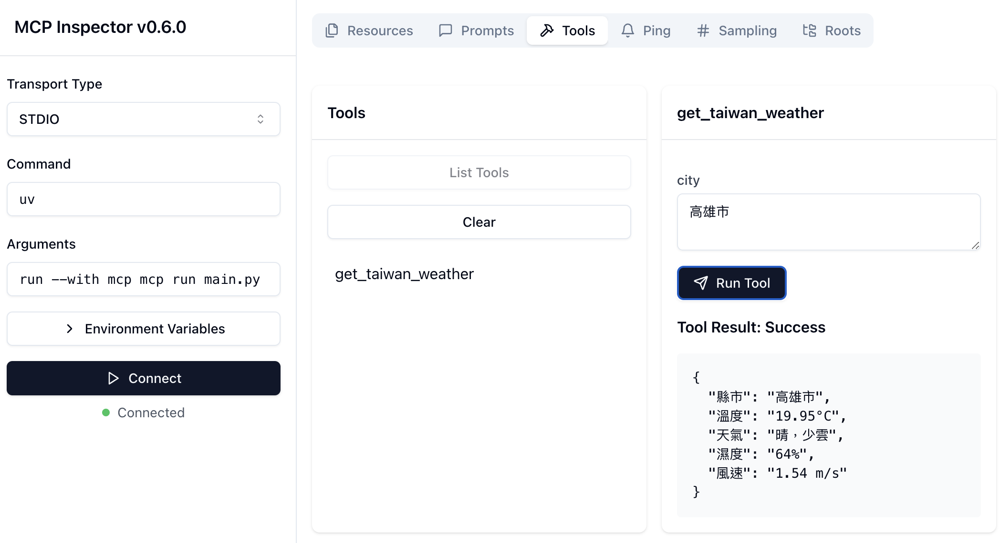
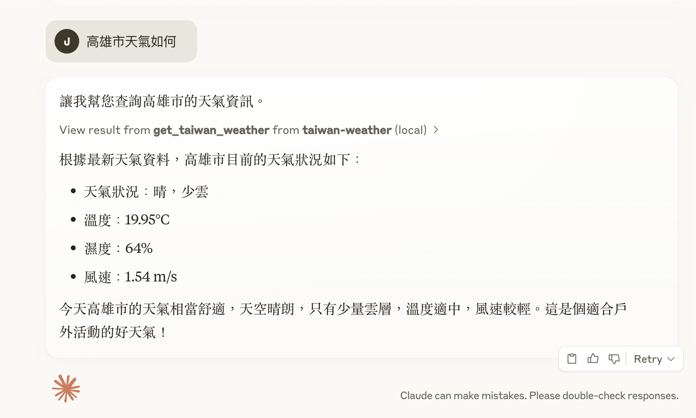

## 說明  

單純用來練習 MCP 使用

## 使用 pyenv 來管理 python 版本

- install python
```bash
pyenv install 3.12.7
```

- Set local Python version
```bash
pyenv local 3.12.7
```

- create the project virtaul enviroment
```bash
python -m venv .venv
```

- activate the env
```bash
source .venv/bin/activate
```

## install package
- install uv
```
pip install uv
```

- install dependencies via uv 
```
uv pip install -e .
```

## run dev
```bash
mcp dev main.py
```

## test
目前測試只能輸入
`"臺北市","新北市","桃園市","臺中市","臺南市","高雄市","基隆市","新竹市","嘉義市","宜蘭縣","新竹縣","苗栗縣","彰化縣","南投縣","雲林縣","嘉義縣","屏東縣","臺東縣","花蓮縣","澎湖縣"`
尚未串接 LLM

```
http://localhost:5173
```

## 測試圖
- MCP DEV TOOL



- MCP TOOL in Claude


